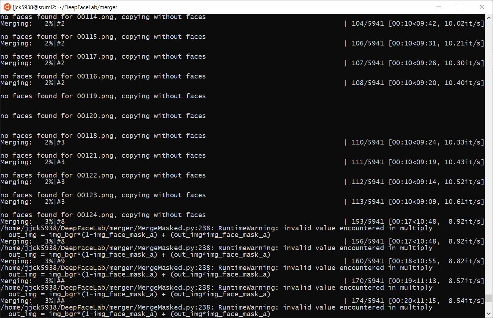
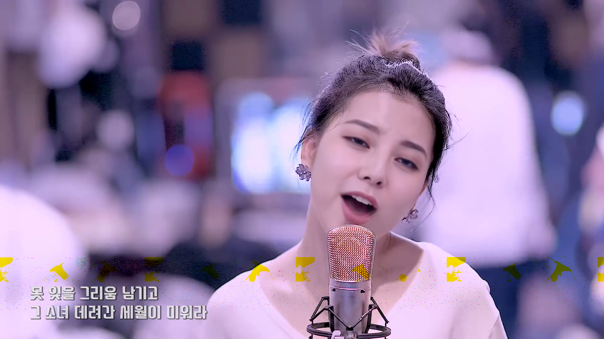

20.07.23 버그 발견

```sh
/home/jjck5938/DeepFaceLab/merger/MergeMasked.py:238: RuntimeWarning: invalid value encountered in multiply
  out_img = img_bgr*(1-img_face_mask_a) + (out_img*img_face_mask_a)
Merging:   3%|#8                     | 156/5941 [00:17<10:48,  8.92it/s]/home/jjck5938/DeepFaceLab/merger/MergeMasked.py:238: RuntimeWarning: invalid value encountered in multiply
  out_img = img_bgr*(1-img_face_mask_a) + (out_img*img_face_mask_a)
Merging:   3%|#9                     | 160/5941 [00:18<10:55,  8.82it/s]/home/jjck5938/DeepFaceLab/merger/MergeMasked.py:238: RuntimeWarning: invalid value encountered in multiply
  out_img = img_bgr*(1-img_face_mask_a) + (out_img*img_face_mask_a)
Merging:   3%|##                     | 170/5941 [00:19<11:13,  8.57it/s]/home/jjck5938/DeepFaceLab/merger/MergeMasked.py:238: RuntimeWarning: invalid value encountered in multiply
  out_img = img_bgr*(1-img_face_mask_a) + (out_img*img_face_mask_a)
Merging:   3%|##                     | 174/5941 [00:20<11:15,  8.54it/s]/home/jjck5938/DeepFaceLab/merger/MergeMasked.py:238: RuntimeWarning: invalid value encountered in multiply
  out_img = img_bgr*(1-img_face_mask_a) + (out_img*img_face_mask_a)

```


- 문제 : merge 단계에서 위와같이 연산에 오류가 발생하게 됨

*문제의 결과로 영상에 노이즈가 발생함


- 원인 : linux opencv makes nan values
  리눅스 내에서만 발생하는 오류로 리눅스 opencv는 nan value를 만들어낸다. 그래서 곱셈 연산을 할 때 nan과 곱하기 때문에 오류를 일으킨다.
  
- 해결 : nan은 계산이 불가능한 값이기 때문에 numpy 함수인 nan_to_num을 통해 계산이 가능한 num값으로 바꾸어준다.
-  코드를 추가하면 문제없이 해결된다.

```python
  img_bgr = np.nan_to_num(img_bgr)
  img_face_mask_a = np.nan_to_num(img_face_mask_a)
  out_img = np.nan_to_num(out_img)
```